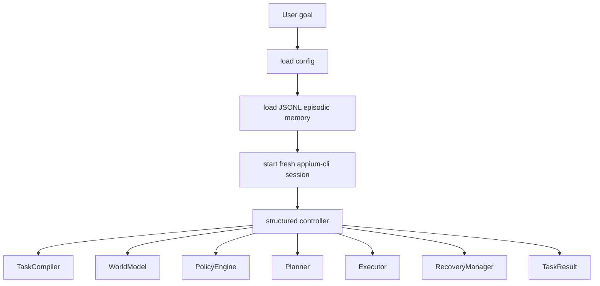

# agent-browser

Production-oriented mobile browser automation built on the [`appium-cli`](../README.md)
tool surface, with an optional OpenAI-backed legacy ReAct controller.

## Architecture

`agent-browser` defaults to a **structured Appium controller** that compiles the
user goal into ordered mandatory steps, keeps a snapshot-backed world model, and
uses deterministic policy/planning/recovery. The legacy OpenAI ReAct loop is
still available via `--controller=react`.

See [agent-browser loop architecture](../docs/agent-browser-loop.md) for the
full module diagram, data flow, sequence diagrams, design trade-offs, and
implementation map.



### Why single-agent?

A previous multi-agent prototype required 6-8 LLM API calls per browser step
because of orchestrator/handoff overhead. The current default folds planning,
observation, policy, recovery, and verification into a deterministic structured
controller, while the legacy OpenAI ReAct loop remains available with
`--controller=react`.

## Prerequisites

`agent-browser` is **observation-only** for prerequisites. It will not install
Appium, Android SDK, drivers, or Node.js for you.

You must have:

- Appium server running at `localhost:4723` (override with
  `AGENT_BROWSER_APPIUM_PORT`).
- Android emulator or physical device connected via `adb`.
- Parent `appium-cli` package installed (this project depends on it via the
  local editable path in `pyproject.toml`).
- `OPENAI_API_KEY` set in environment or `.env` only when using
  `--controller=react` or future LLM-assisted disambiguation.

## Install

```bash
cd agent-browser
uv sync
```

This installs:

- `openai`
- `pydantic`
- `python-dotenv`
- the parent `appium-cli` package as an editable dependency

## Run a task

```bash
# preferred smoke test (deterministic, no CAPTCHA)
uv run agent-browser \
  "Navigate to https://example.com and return the page title and URL"

# JSON output for downstream tooling
uv run agent-browser --json "Open https://example.com and report the page title"
```

The CLI prints structured progress logs to stderr (tool calls, durations,
guardrail decisions, retries, screenshots). Use `--log-level DEBUG` for more.

## Safety policy

- Sensitive actions (login, password entry, payment, purchase, reservation
  confirmation, personal data submission, submit/finalize buttons matched to a
  sensitive context) are stopped locally with `APPROVAL_REQUIRED`; they do not
  reach the daemon without a local approval record.
- A small set of destructive tools is **blocked unconditionally** locally and
  never reach the daemon (`terminate_app`, `restart_app`, `set_orientation`).
- Credentials must NEVER be passed on the command line or hard-coded. Provide
  them through your own out-of-band mechanism.
- Argument values that look like sensitive content are summarized, not logged.
  Screenshot base64 is stripped from model-facing output; the saved artifact
  path is used instead.
- The agent avoids Enter-based submission on intermediate fields of multi-field
  forms. `submit=true` is reserved for intentional submission steps and is not
  used for autocomplete / React-Select style controls.

## Artifacts and memory

- **Artifacts**: normal screenshots are saved by `appium-cli` under
  `.appium-cli/<session-id>/`, and agent-browser records the returned path
  without saving a duplicate. The agent receives only a short reference back,
  not the base64 payload. `AGENT_BROWSER_ARTIFACTS_DIR` is a fallback location
  used only if an older screenshot response does not include a path.
- **Episodic memory**: `MemoryEvent` records (tool successes/failures and task
  outcomes) are appended to `AGENT_BROWSER_MEMORY_PATH` (default
  `.agent-browser-memory.jsonl`).
- **Operation state**: each iteration sends only the goal, phase, latest
  observation/current screen, bounded `working_state`, the last 5 short step
  records, and optional loop/reflection warnings. Old snapshots, stale refs,
  raw function calls, reasoning items, and screenshot base64 are not replayed.

## Completion verification

Completion verification is a gate, not a quality grader. A deterministic
structural guard runs first, then the optional LLM judge (`AGENT_BROWSER_JUDGE_MODEL`,
default `gpt-4.1`) checks the final result together with the compact tool trace.
The judge should verify only explicit user requirements, treat later successful
retries as recovery, and avoid requiring titles, URLs, citations, proof
statements, or character-count declarations unless the user asked for them.

## Known limitations

- **Google search triggers CAPTCHA** under automation. Prefer deterministic
  destinations (the OpenAI Agents docs site, `example.com`, etc.) for smoke
  tests. If you must search, use a non-Google search engine or a direct URL.
- **iOS Safari** is intentionally extension-ready (`AGENT_BROWSER_PLATFORM`)
  but not yet wired into the default workflow.
- **Strict JSON schemas** may require normalization for some appium-cli tool
  schemas because the registry uses defaults and partial `required` lists.

## Tests

```bash
uv run pytest
```

Unit tests cover schemas, state/history/prompt construction, guardrails, and
the appium-cli tool bridge (with a mocked daemon `call_tool`). E2E coverage requires a running
Appium server and a connected device and is intentionally excluded from the
default test run.
