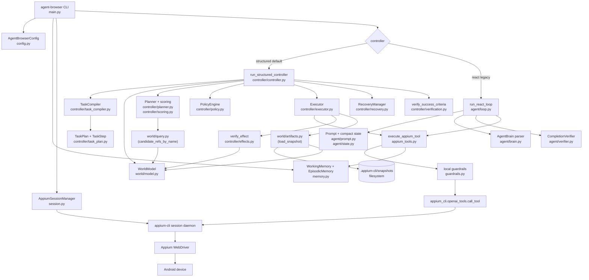
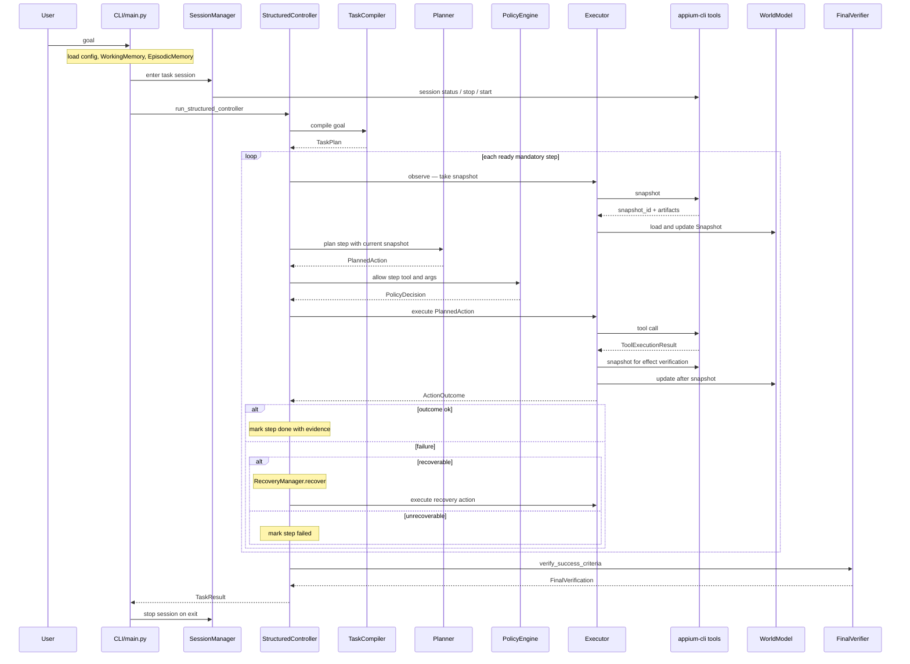
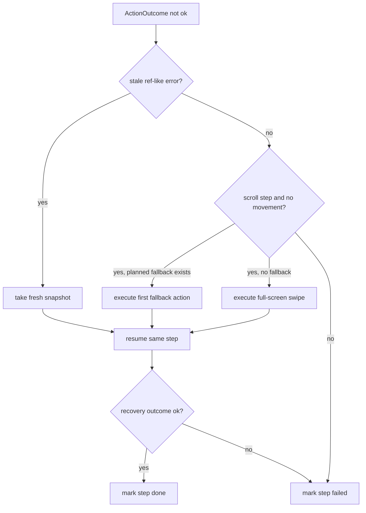
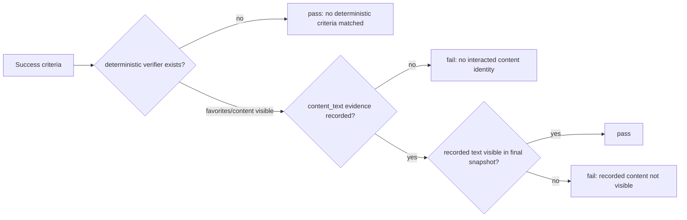
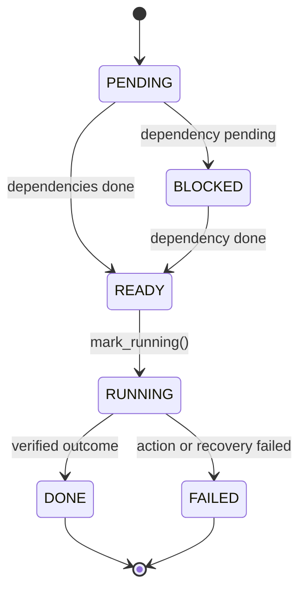

# agent-browser loop architecture

This document captures the current `agent-browser` loop design so future
agents can reuse the same architecture patterns. It focuses on the default
structured controller and compares it with the legacy OpenAI-backed ReAct loop.

`agent-browser` is an agent package built on top of the `appium-cli` tool
surface. The `appium-cli` tools remain LLM-free; `agent-browser` owns task
planning, state, safety, recovery, and result handling.

## Scope

This document covers:

- the default structured controller loop
- the optional `--controller=react` loop
- module boundaries and data flow
- state, artifacts, memory, recovery, and verification
- design trade-offs and extension points for future agents

This document does not cover:

- Appium, Android SDK, or driver installation
- the full `appium-cli` command reference
- adding LLM behavior inside `appium-cli` tools

## Why this loop exists

Mobile UI automation needs more than a generic model/tool loop. A robust agent
must keep explicit task order, use current snapshot refs, verify that UI effects
actually happened, and recover when refs become stale or a scroll affects the
wrong container.

Earlier agent designs leaned on multi-agent or model-heavy ReAct control. That
made browser steps flexible, but it also increased model-call overhead, replayed
too much history, and made step ordering and verification harder to test. The
current default design moves predictable control logic into deterministic
modules and keeps LLM use optional.

The result is two controller paths:

| Area | Structured controller | `--controller=react` |
|---|---|---|
| Default | yes | no |
| OpenAI key required | no | yes |
| Planning | `TaskCompiler` and deterministic `Planner` | model action response |
| Runtime state | `TaskPlan` plus `WorldModel` | `BrowserOperationState` plus `OperationHistory` |
| Tool execution | `execute_appium_tool` bridge | same bridge |
| Effect verification | snapshot diff and deterministic final checks | structural guard plus optional LLM judge |
| Strength | predictable, testable, lower model overhead | more flexible for open-ended tasks |
| Weakness | narrower heuristic coverage | model-call cost and protocol/parse failures |

## Module architecture



## Task-scoped runtime sequence

The structured controller runs one task against one fresh Appium session.



## Data flow

```mermaid
flowchart LR
    Goal["User goal"] --> Config["Config<br/>.env + env vars"]
    Goal --> Context["BrowserAgentContext"]
    Config --> Context
    MemoryIn["JSONL episodic memory"] --> Context
    Context --> Plan["TaskPlan<br/>steps + criteria"]

    Plan --> Action["PlannedAction"]
    SnapshotOut["snapshot text output"] --> SnapshotArtifacts[".appium-cli/snapshots<br/>index/meta/refs files"]
    SnapshotArtifacts --> Snapshot["normalized Snapshot<br/>refs, text targets, containers"]
    Snapshot --> World["WorldModel<br/>current + previous"]
    World --> Action

    Action --> Policy["PolicyDecision"]
    Policy --> ToolCall["execute_appium_tool"]
    ToolCall --> Guardrails["Safety classification<br/>safe/sensitive/blocked"]
    Guardrails --> Daemon["appium-cli session daemon"]
    Daemon --> ToolResult["ToolExecutionResult"]

    ToolResult --> WorkingMemory["WorkingMemory<br/>tool_calls, failures, retries, artifacts"]
    ToolResult --> Observation["ObservationSummary"]
    ToolResult --> Effect["ActionOutcome<br/>before/after ids + diff"]
    World --> Effect
    Effect --> Recovery["Recovery decision"]
    Effect --> StepStatus["TaskStep status/evidence"]
    StepStatus --> Final["FinalVerification"]
    Final --> Result["TaskResult<br/>text or JSON output"]

    WorkingMemory --> MemoryOut[".agent-browser-memory.jsonl"]
    ToolResult --> ScreenshotArtifacts["screenshot/artifact paths"]
```



## Structured controller loop

The default loop lives in
`agent-browser/src/agent_browser/controller/controller.py`.

At startup it creates:

- `TaskPlan` from `TaskCompiler().compile(goal)`
- `WorldModel` for current and previous snapshots
- `Executor` for tool calls and effect verification
- `Planner` for deterministic action selection
- `PolicyEngine` for step-order and ref-safety checks
- `RecoveryManager` for common failure handling

The main loop repeatedly selects `plan.next_ready_step()`, marks it running,
plans an action, checks policy, executes and verifies the action, then marks the
step done or failed. After all mandatory steps finish, it runs
`verify_success_criteria(plan, world)`.

### Task compilation

`TaskCompiler` preserves explicit numbered steps and extracts success criteria
from expectation sections. It classifies steps into `StepKind` values:

- `LAUNCH`
- `NAVIGATE`
- `SCROLL`
- `INTERACT`
- `VERIFY`
- `WAIT`

Each mandatory step depends on the previous mandatory step. That simple
dependency chain is important: it prevents later interactions from jumping ahead
of required navigation or scroll steps.

### Planning

`Planner` converts a `TaskStep` plus the current `Snapshot` into a
`PlannedAction`. The action includes:

- the `appium-cli` tool name
- tool arguments
- a rationale
- the expected effect
- the verification mode
- optional fallback actions

For scrolls, `Planner` ranks scrollable containers with
`rank_scroll_containers()`. The scoring favors large main-content containers and
penalizes headers, navigation bars, tab menus, and chip lists. If no container is
usable, it falls back to full-screen swipe.

For navigation and interaction, `Planner` searches snapshot text targets and
refs by name. Interaction planning normalizes favorite-like targets to make
common content-saving flows deterministic.

### Policy

`PolicyEngine` enforces constraints before a tool call reaches the executor:

- strict mandatory step order
- no stale or unknown refs when current refs are known
- scroll steps may only call observation, scroll, or swipe tools

This separation is intentional. The planner proposes an action; policy decides
whether that action is safe and valid for the current step.

### Execution and effect verification

`Executor` wraps `execute_appium_tool()` and updates `WorldModel` from snapshot
artifacts. For actions that need verification, it captures before/after
snapshots and calls `verify_effect()`.

The effect verifier uses lightweight snapshot diffs:

- added refs
- removed refs
- moved refs
- changed text targets

No-effect actions fail unless the expected effect explicitly allows deferred
verification, such as a favorite tap whose final state is checked later.

### Recovery



`RecoveryManager` currently handles two high-value failure modes:

1. stale refs or unresolved refs by refreshing the snapshot
2. scroll actions with no visible movement by trying planned fallbacks or a
   full-screen swipe

Other failures are surfaced as step failures. This keeps recovery predictable
and testable.

### Final verification

Final verification is deterministic in the structured controller. If no explicit
success criteria exist, verification passes with a reason of
`no explicit success criteria`.

For favorite/content-visible flows, the controller records content identity near
the interaction target before tapping the favorite control. After navigation to
the final page, `verify_success_criteria()` checks that the recorded content text
is visible in the current snapshot.



## Task step state machine



The current controller schedules the first ordered ready mandatory step. Later
mandatory steps remain blocked until earlier mandatory steps are done. The
`SKIPPED` status is defined on `StepStatus` for future use but is not produced
by the current controller.

## Tool bridge, guardrails, and memory

Both controller paths use the same bridge in
`agent-browser/src/agent_browser/appium_tools.py`.

`execute_appium_tool()` performs these steps:

1. Normalize snapshot arguments so agent workflows do not write arbitrary files
   to the working directory.
2. Classify the pending call with local guardrails.
3. Refuse blocked tools locally.
4. Return `APPROVAL_REQUIRED` for sensitive actions without an approval record.
5. Dispatch safe calls to `appium_cli.openai_tools.call_tool()`.
6. Convert daemon responses into `ToolExecutionResult`.
7. Record tool calls, failures, retry counts, observations, artifacts, and JSONL
   episodic memory events.

The local guardrail layer blocks destructive tools such as `terminate_app`,
`restart_app`, and `set_orientation`. It also detects sensitive actions around
login, passwords, payment, purchases, reservations, and personal data.

`WorkingMemory` is per-run state. It tracks:

- current URL
- latest observation
- failures
- approvals
- artifacts
- retry counts
- tool call records

`EpisodicMemory` persists append-only `MemoryEvent` records to
`.agent-browser-memory.jsonl`.

## Legacy ReAct loop

The legacy loop lives in `agent-browser/src/agent_browser/agent/loop.py` and is
selected with `--controller=react`.

```mermaid
sequenceDiagram
    participant Loop as run_react_loop
    participant Prompt as build_input_items
    participant LLM as Responses API
    participant Tools as execute_appium_tool
    participant Brain as AgentBrain parser
    participant Verify as CompletionVerifier

    loop each turn
        Loop->>Prompt: compact state, recent steps, reflection
        Prompt-->>Loop: input items
        Loop->>LLM: action call with tools
        LLM-->>Loop: function_call output
        Loop->>Tools: execute returned tool call
        Tools-->>Loop: ToolExecutionResult
        Loop->>LLM: continuation with function_call_output
        LLM-->>Loop: brain JSON text
        Loop->>Brain: parse_agent_brain text
        Brain-->>Loop: working_state, next_goal, is_done
        alt done
            Loop->>Verify: structural guard and optional LLM judge
            Verify-->>Loop: pass/fail feedback
        else continue
            Note over Loop: update history and loop detector
        end
    end
```

The ReAct loop has safeguards that the structured controller does not need in
the same form:

- wall-time limit
- no-progress limit
- consecutive no-tool-call failure handling
- retry-based tool blocking
- compact `BrowserOperationState`
- loop warnings and reflection feedback
- response diagnostics for invalid brain JSON
- token usage and billing summaries

Use the ReAct path when model flexibility matters more than deterministic step
coverage. Use the structured controller when a task can be represented as
ordered steps over snapshot-backed UI state.

## Current implementation map

| Concern | Files |
|---|---|
| CLI and run orchestration | `agent-browser/src/agent_browser/main.py` |
| Runtime configuration | `agent-browser/src/agent_browser/config.py` |
| Session lifecycle | `agent-browser/src/agent_browser/session.py` |
| Tool bridge | `agent-browser/src/agent_browser/appium_tools.py` |
| Guardrails | `agent-browser/src/agent_browser/guardrails.py` |
| Per-run and episodic memory | `agent-browser/src/agent_browser/memory.py` |
| Result and event schemas | `agent-browser/src/agent_browser/schemas.py` |
| Structured controller loop | `agent-browser/src/agent_browser/controller/controller.py` |
| Task compiler and plan model | `agent-browser/src/agent_browser/controller/task_compiler.py`, `agent-browser/src/agent_browser/controller/task_plan.py` |
| Planning and scoring | `agent-browser/src/agent_browser/controller/planner.py`, `agent-browser/src/agent_browser/controller/scoring.py` |
| Execution and effects | `agent-browser/src/agent_browser/controller/executor.py`, `agent-browser/src/agent_browser/controller/effects.py` |
| Recovery | `agent-browser/src/agent_browser/controller/recovery.py` |
| Final verification | `agent-browser/src/agent_browser/controller/verification.py` |
| Snapshot world model | `agent-browser/src/agent_browser/world/model.py`, `agent-browser/src/agent_browser/world/artifacts.py`, `agent-browser/src/agent_browser/world/diff.py`, `agent-browser/src/agent_browser/world/query.py` |
| Legacy ReAct loop | `agent-browser/src/agent_browser/agent/loop.py` |
| ReAct prompt/state/parser | `agent-browser/src/agent_browser/agent/prompt.py`, `agent-browser/src/agent_browser/agent/state.py`, `agent-browser/src/agent_browser/agent/brain.py` |
| ReAct history and verification | `agent-browser/src/agent_browser/agent/history.py`, `agent-browser/src/agent_browser/agent/verifier.py` |
| ReAct model client and registry | `agent-browser/src/agent_browser/agent/llm.py`, `agent-browser/src/agent_browser/agent/registry.py` |

## Design strengths

- The default path does not require an OpenAI key.
- Planning, policy, recovery, and verification are independently testable.
- Snapshot-backed refs and before/after diffs make action effects observable.
- Strict step ordering prevents a later action from skipping mandatory setup.
- Local guardrails run before any daemon call.
- Artifacts and memory are recorded by the tool bridge rather than scattered
  across controller code.
- The ReAct loop remains available for cases where deterministic planning is too
  narrow.

## Design weaknesses and trade-offs

- The structured compiler and planner are heuristic. They do not understand all
  possible natural-language tasks.
- Final deterministic verification is intentionally narrow today. New app flows
  may need dedicated verifiers.
- Scroll and target scoring may need app-specific tuning for unusual layouts.
- Recovery handles stale refs and no-movement scrolls, but not every UI failure.
- The structured controller currently executes one mandatory step at a time and
  does not attempt parallel planning.
- If a task requires broad semantic reasoning, the legacy ReAct loop or a future
  LLM-assist extension may still be needed.

## Extension points

Future agents should extend the structured path at narrow boundaries:

- Add step classification or argument extraction in `TaskCompiler`.
- Add app-agnostic target selection in `Planner` or `world/query.py`.
- Add scoring features in `controller/scoring.py`.
- Add expected effects and verification modes in `controller/effects.py`.
- Add deterministic recovery cases in `RecoveryManager`.
- Add final success criteria handlers in `controller/verification.py`.
- Add optional LLM assistance behind a budgeted boundary rather than replacing
  the whole loop.

## Lessons for future agents

- Keep `appium-cli` tools as deterministic tool endpoints; put agent behavior in
  the caller.
- Use a fresh session per task when reproducibility matters.
- Represent the task as explicit state before choosing tools.
- Treat snapshot refs as current-snapshot handles, not permanent identifiers.
- Refresh snapshots after stale-ref failures.
- Decide the expected effect before executing an action.
- Verify effects with observations, not with the fact that a tool returned `OK`.
- Separate planning from policy so invalid actions can be blocked locally.
- Record evidence at the moment an intermediate action creates information that
  final verification will need.
- Prefer deterministic recovery before asking an LLM to reason about failure.
- Persist only low-sensitivity operational memory.
- Unit-test the compiler, planner, policy, recovery, effects, and final
  verification separately.
