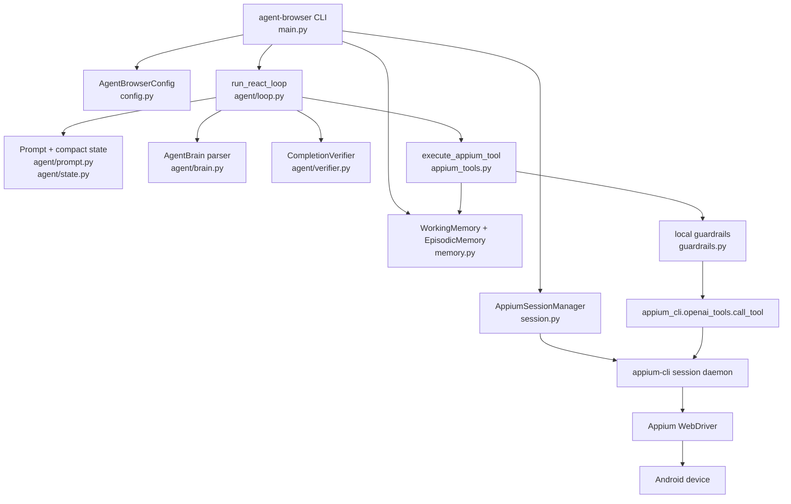
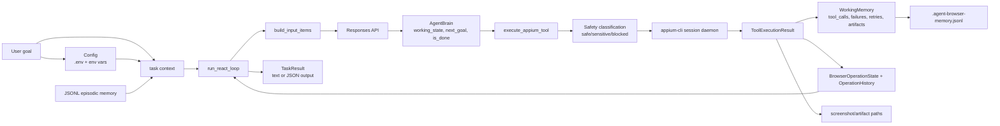

# agent-browser loop architecture

This document captures the `agent-browser` ReAct loop design so future agents
can reuse the same architecture patterns. `agent-browser` is an agent package
built on top of the `appium-cli` tool surface. The `appium-cli` tools remain
LLM-free; `agent-browser` owns task planning, state, safety, and result handling.

## Scope

This document covers:

- the ReAct loop and its turn structure
- module boundaries and data flow
- tool bridge, guardrails, and memory
- billing and token attribution
- design trade-offs and extension points for future agents

This document does not cover:

- Appium, Android SDK, or driver installation
- the full `appium-cli` command reference
- adding LLM behavior inside `appium-cli` tools

## Module architecture



## ReAct loop

The loop lives in `agent-browser/src/agent_browser/agent/loop.py`.

```mermaid
sequenceDiagram
    participant User
    participant CLI as CLI/main.py
    participant Session as SessionManager
    participant Loop as run_react_loop
    participant Prompt as build_input_items
    participant LLM as Responses API
    participant Tools as execute_appium_tool
    participant Brain as AgentBrain parser
    participant Verify as CompletionVerifier

    User->>CLI: goal
    Note over CLI: load config, WorkingMemory, EpisodicMemory
    CLI->>Session: enter task session
    Session->>Tools: session status / stop / start
    CLI->>Loop: run_react_loop

    loop each turn
        Loop->>Prompt: compact state, recent steps, reflection
        Prompt-->>Loop: input items
        Loop->>LLM: action call with tools
        LLM-->>Loop: function_call output
        Loop->>Tools: execute returned tool call
        Tools-->>Loop: ToolExecutionResult
        Loop->>LLM: continuation with function_call_output
        LLM-->>Loop: brain JSON text
        Loop->>Brain: parse_agent_brain text
        Brain-->>Loop: working_state, next_goal, is_done
        alt done
            Loop->>Verify: structural guard and optional LLM judge
            Verify-->>Loop: pass/fail feedback
        else continue
            Note over Loop: update history and loop detector
        end
    end

    Loop-->>CLI: TaskResult
    CLI->>Session: stop session on exit
```

The loop has several safeguards:

- wall-time limit (`max_wall_seconds`)
- no-progress limit (`max_no_progress_steps`)
- consecutive no-tool-call failure handling
- retry-based tool blocking
- compact `BrowserOperationState`
- loop warnings and reflection feedback
- response diagnostics for invalid brain JSON
- token usage and billing summaries

## Data flow



## Tool bridge, guardrails, and memory

The tool bridge lives in `agent-browser/src/agent_browser/appium_tools.py`.

`execute_appium_tool()` performs these steps:

1. Normalize snapshot arguments so agent workflows do not write arbitrary files
   to the working directory.
2. Classify the pending call with local guardrails.
3. Refuse blocked tools locally.
4. Return `APPROVAL_REQUIRED` for sensitive actions without an approval record.
5. Dispatch safe calls to `appium_cli.openai_tools.call_tool()`.
6. Convert daemon responses into `ToolExecutionResult`.
7. Record tool calls, failures, retry counts, observations, artifacts, and JSONL
   episodic memory events.

The local guardrail layer blocks destructive tools such as `terminate_app`,
`restart_app`, and `set_orientation`. It also detects sensitive actions around
login, passwords, payment, purchases, reservations, and personal data.

`WorkingMemory` is per-run state. It tracks:

- current URL
- latest observation
- failures
- approvals
- artifacts
- retry counts
- tool call records

`EpisodicMemory` persists append-only `MemoryEvent` records to
`.agent-browser-memory.jsonl`.

## Billing and token attribution

`agent-browser` tracks LLM usage per task run. The loop records each Responses
API action/brain call; optional semantic verification records LLM judge calls.

OpenAI API usage is authoritative at the model-request level: input, cached
input, output, reasoning output, and cost are computed per LLM invocation and
summed for the final total. The API does not expose token usage per individual
tool result, so tool-token rows are local estimates of the tool payload text that
was included in the following model input. They are displayed as an attribution
breakdown of that call's input, never as extra billable tokens, and are capped to
the call's uncached input token count.

## Current implementation map

| Concern | Files |
|---|---|
| CLI and run orchestration | `agent-browser/src/agent_browser/main.py` |
| Runtime configuration | `agent-browser/src/agent_browser/config.py` |
| Session lifecycle | `agent-browser/src/agent_browser/session.py` |
| Tool bridge | `agent-browser/src/agent_browser/appium_tools.py` |
| Guardrails | `agent-browser/src/agent_browser/guardrails.py` |
| Per-run and episodic memory | `agent-browser/src/agent_browser/memory.py` |
| Result and event schemas | `agent-browser/src/agent_browser/schemas.py` |
| ReAct loop | `agent-browser/src/agent_browser/agent/loop.py` |
| ReAct prompt/state/parser | `agent-browser/src/agent_browser/agent/prompt.py`, `agent-browser/src/agent_browser/agent/state.py`, `agent-browser/src/agent_browser/agent/brain.py` |
| ReAct history and verification | `agent-browser/src/agent_browser/agent/history.py`, `agent-browser/src/agent_browser/agent/verifier.py` |
| ReAct model client and registry | `agent-browser/src/agent_browser/agent/llm.py`, `agent-browser/src/agent_browser/agent/registry.py` |

## Design strengths

- Snapshot-backed refs and before/after history make action effects observable.
- Local guardrails run before any daemon call.
- Artifacts and memory are recorded by the tool bridge rather than scattered
  across agent code.
- The loop detector and reflection feedback help unstick common failure modes.
- Token usage and billing are tracked at the call level.

## Design weaknesses and trade-offs

- Model-call overhead increases with task length because history grows.
- Open-ended tasks rely on model judgment for step ordering, which can vary
  between runs.
- The completion verifier uses an LLM judge as a backstop, which adds latency
  and cost on the final turn.

## Extension points

Future agents can extend the loop at narrow boundaries:

- Add prompt fragments or few-shot examples in `agent/prompt.py`.
- Add new tool-call result handlers in `appium_tools.py`.
- Add deterministic post-action checks in `appium_tools.py` before the result
  is returned to the loop.
- Add new `MemoryEvent` kinds to `memory.py` for richer episodic history.
- Add verification modes to `agent/verifier.py`.
- Add optional LLM assistance behind a budgeted boundary rather than replacing
  the whole loop.

## Lessons for future agents

- Keep `appium-cli` tools as deterministic tool endpoints; put agent behavior in
  the caller.
- Use a fresh session per task when reproducibility matters.
- Treat snapshot refs as current-snapshot handles, not permanent identifiers.
- Refresh snapshots after stale-ref failures.
- Verify effects with observations, not with the fact that a tool returned `OK`.
- Record evidence at the moment an intermediate action creates information that
  final verification will need.
- Prefer deterministic recovery before asking an LLM to reason about failure.
- Persist only low-sensitivity operational memory.
